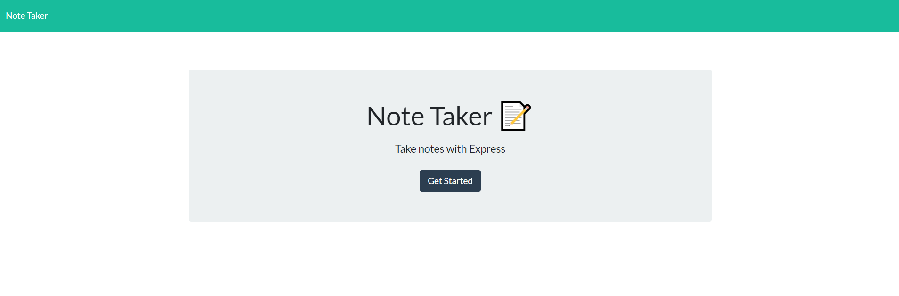
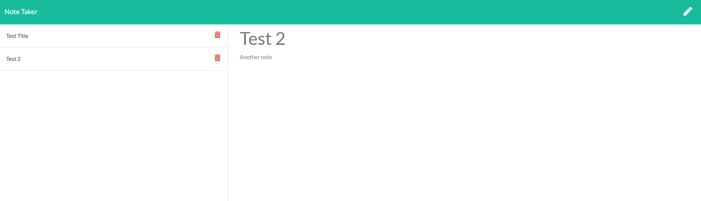

# Note Taker Application

  ## Links:  

  Live Demo:   
  Repository: https://github.com/mbussert/note-taker  

  ## Description: 

  A simple Node application that can be used to write and save notes. This application uses an Express.js back-end and will save and retrieve note data from a JSON file on the server.

   

  ## Table of Contents: 

  * [Installation](#installation)
  * [Usage](#usage)
  * [License](#license)
  * [Contributing](#contributing)
  * [Testing](#tests)
  * [Contact](#contact)

  ## Installation: 

  This application is run on the back-end by the server.js file and all data is then served via Express.

  ## Usage: 

  A user clicks through the website interface to save, load, and delete notes.  

    

    

  ## License: 

  This application is covered under the GNU GPLv3 license.

  ## Contributing: 

  Users are free to contribute to this project.

  ## Tests: 

  Not tests have been setup for the application.

  ## Questions: 

  GitHub: [mbussert](https://github.com/mbussert)  
  By Email: [mbussert@gmail.com](mailto:mbussert@gmail.com)
